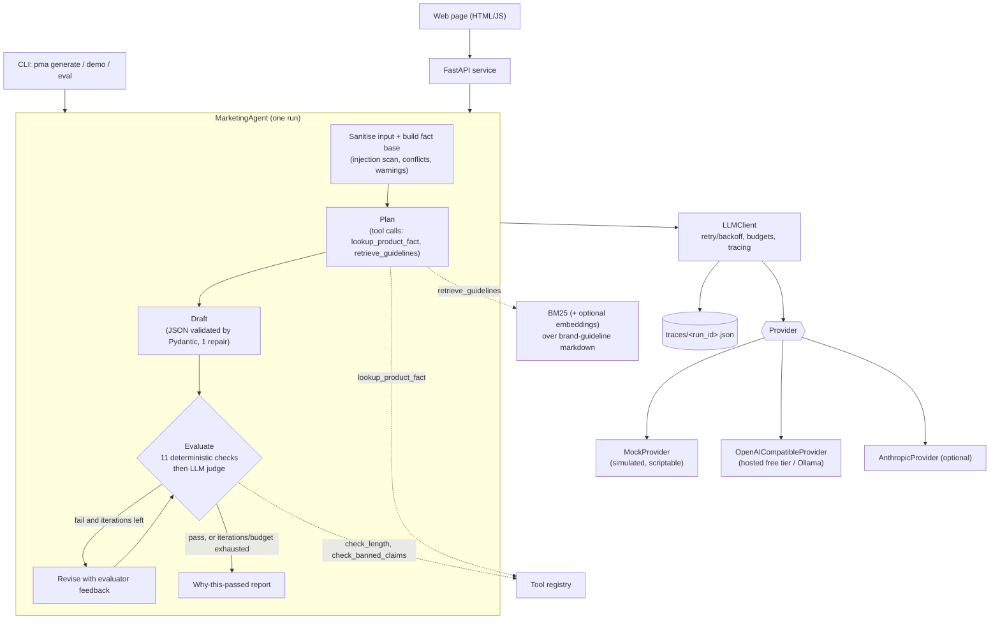

# Product Marketing Agent

An LLM agent that turns **structured product data** (name, category, specs, price, audience) into
**English and Dutch marketing copy** for a B2B IT retailer: product description, short ad copy,
social post and three email subject lines. It is built as a small, inspectable agent system rather
than a prompt wrapper:

- **plan -> draft -> evaluate -> revise** loop (bounded), with tool use and RAG over brand guidelines
- a **deterministic evaluator** (length, banned claims, "every number/spec must exist in the data",
  conflicts, language, prompt-injection echo) plus an **LLM judge**
- **reliability** (timeouts, retries with backoff, JSON validation + one repair, token/cost/call budgets)
- **observability** (per-run JSON trace, versioned prompt files, structured logs)
- **prompt-injection handling** for untrusted product data
- FastAPI service, CLI and a plain HTML/JS page; runs fully offline with a deterministic mock provider

No LangChain, no agent framework: `httpx` + `pydantic` + FastAPI only.

> **Read this first - what is simulated.** The offline demo, the test suite and the large
> evaluation tables in [Results](#results-mock-provider-only) run against `MockProvider`, a
> **rule-based simulator, not a language model**. It writes template copy and injects *scripted*
> mistakes so the surrounding system can be exercised; those percentages say nothing about real
> model quality. A small run against one real model (Groq free tier, `openai/gpt-oss-120b`) is
> documented in [Real-model run](#real-model-run-small-one-provider). It found real bugs, and it
> did **not** show that the agent beats a single prompt. See also
> [Verified here / NOT VERIFIED](#verified-here--not-verified).

## Architecture



| Step | What happens | Code |
|---|---|---|
| Prepare | Injection scan + sanitise, build fact base (allowed numbers/units, conflicts, warnings) | `security.py`, `facts.py` |
| Plan | Model calls tools (native tool calling, or a validated JSON protocol) and returns a `Plan` | `tool_runtime.py`, `tools.py` |
| Draft | Model returns one JSON object per language; validated, one repair attempt | `llm_client.py`, `reliability.py` |
| Evaluate | Deterministic checks, then LLM judge (only if checks pass) | `evaluator.py`, `agent.py` |
| Revise | Feedback lines (`[numbers_supported] en.description ... 73`) go back to the model; max `AGENT_MAX_ITERATIONS` (default 3) | `agent.py` |
| Report | "Why this passed/failed" built from evaluator evidence, never from the model's self-assessment | `agent.build_report` |

## Quick start (offline, mock provider)

```bash
python -m venv .venv && source .venv/bin/activate
pip install -e ".[dev]"

pma demo                      # three products end to end, prints copy + why-report
pma generate --example demo-3 # one product (see `src/pma/data/examples.json`)
pma serve                     # http://127.0.0.1:8000  (web page + JSON API + /docs)
```

The default mock (`MOCK_BEHAVIOR=demo`) deliberately makes a scripted mistake on some products so
you can watch the evaluator catch it and the revision fix it. `MOCK_BEHAVIOR=clean` disables that.

### API

```bash
curl -s localhost:8000/api/generate -H 'content-type: application/json' -d '{
  "product": {"name": "Dell Latitude 5440", "category": "Laptop",
              "specs": {"RAM": "16 GB", "Storage": "512 GB SSD"}, "price": 1299,
              "audience": "IT managers"},
  "languages": ["en", "nl"]}'
```

| Endpoint | Purpose |
|---|---|
| `POST /api/generate` | full agent loop -> `AgentResult` (draft, evaluations, report, security, usage, trace path) |
| `POST /api/baseline` | single-prompt baseline, scored by the same evaluator |
| `GET /api/traces/{run_id}` | the run's JSON trace |
| `GET /api/config`, `/health`, `/api/examples`, `/api/guidelines/search?q=` | introspection helpers |
| `GET /` | the web page |

Failed or budget-stopped runs return HTTP 200 with `status` set (`passed`, `failed`,
`budget_exceeded`, `error`) so the caller always receives the report. Input is size-limited and
validated (422 on violations). There is **no authentication or rate limiting**: put it behind a
gateway before exposing it.

## Using a real provider

Copy `.env.example` to `.env` and set the variables (never commit `.env`). Note that the CLI
does **not** read `.env` itself: `export` the variables in your shell, or use `docker compose`,
which loads `.env` through `env_file`.

**Local Ollama (OpenAI-compatible endpoint):**

```bash
export LLM_PROVIDER=openai_compatible
export OPENAI_BASE_URL=http://localhost:11434/v1
export OPENAI_MODEL=llama3.1
pma generate --example demo-3
```

**Hosted free tier** (any OpenAI-compatible API): set `OPENAI_BASE_URL`, `OPENAI_API_KEY`,
`OPENAI_MODEL`. **Anthropic:** `LLM_PROVIDER=anthropic`, `ANTHROPIC_API_KEY`, optionally
`ANTHROPIC_MODEL`.

Notes: tool calling is used natively only if `LLM_SUPPORTS_TOOLS=true` (Anthropic: always);
otherwise the JSON tool protocol is used, which works with any chat model. Set
`PRICE_PER_1K_PROMPT_USD`/`PRICE_PER_1K_COMPLETION_USD` if you want `MAX_COST_USD` to be enforced.

> **Partly verified:** the OpenAI-compatible provider was run against one real hosted endpoint
> (Groq free tier, `openai/gpt-oss-120b`) in small runs, see
> [Real-model run](#real-model-run-small-one-provider). Ollama, other hosted APIs, the Anthropic
> adapter and real embeddings endpoints are still **NOT VERIFIED** (fakes and `httpx.MockTransport`
> only).

### Measuring a real model

```bash
python evals/run_real_provider.py --limit 5   # smoke test (asks for confirmation)
python evals/run_real_provider.py --yes       # all 30 products, baseline and agent
```

It refuses to run with `LLM_PROVIDER=mock`, ignores the scripted flaws, and writes
`evals/results/real_<provider>_<timestamp>.{md,json}`.

## Running with Docker

```bash
cp .env.example .env     # optional
docker compose up --build
```

> **Partly verified:** the GitHub Actions `docker` job builds the image and smoke-tests the
> container (`/health` and one `POST /api/generate` with the mock provider) on every push.
> `docker compose up` itself, and running the container with a real LLM, have not been run.

## Tests and lint

```bash
ruff check . && ruff format --check .
pytest --cov
```

Last run in the build workspace (Python 3.13): **305 tests passed**, line+branch coverage **96%**, `ruff check` and `ruff format --check` clean.

What the suite covers: tools (EN + NL banned-claim patterns, argument validation), BM25/embeddings
retrieval and fallback, number/unit normalisation and conflict handling, every evaluator check,
the full agent loop (revision, max iterations, JSON repair, both tool transports, unknown/invalid
tool calls, retries with backoff, token/cost/call budgets, traces), prompt-injection scenarios
including all injection products of the evaluation set, providers (mock modes; OpenAI-compatible and
Anthropic wire formats; status-code mapping), the API (validation, errors, headers, path traversal),
the CLI, the evaluation harness, and an end-to-end run through `OpenAICompatibleProvider` over real
HTTP against a local fake server.

## Design decisions

Full log in [DECISIONS.md](DECISIONS.md). The ones that matter most:

- **Control flow is code.** The model never decides whether its draft passes; the evaluator does.
  The LLM judge can only add failures (an unusable judge verdict fails closed).
- **Grounding rule: every number must exist in the data.** Numbers are normalised (`1.299,00` =
  `1,299.00` = `1299`) and `number+unit` pairs (`16 GB`, `27 inch`) must match as pairs.
  Conflicting attributes (also across `RAM`/`Memory`/`Geheugen`) are excluded and reported, not guessed.
- **Untrusted data stays data.** Instruction-like sentences are removed before the prompt is built,
  reported in `security`, and the output is scanned for injection phrases and verbatim payload
  fragments. Two independent layers, because heuristics miss things.
- **One LLM choke point** (`LLMClient`): retries/backoff (honours `Retry-After`), budgets, tracing.
- **Two tool transports** (native tool calling, JSON protocol) behind one runtime.
- **Versioned prompts**: `src/pma/prompts/v1/*.md` with front-matter; every trace step records
  `name@version#hash`.
- **Own BM25**, optional embeddings (`RETRIEVER=embeddings|hybrid`, RRF fusion).
- **Sync core** (sequential pipeline; endpoints run in the thread pool).

## Observability

Each run writes `traces/<run_id>.json` (`TRACE_DIR`): ordered steps (`prepare`, `plan`, `llm_call`,
`tool_call`, `validate`, `evaluate`) with latency, prompt reference (`draft@1.0.0#155001ec`), token
counts (flagged `tokens_estimated` when the provider reports none), retries and failed checks. By
default prompts/outputs are stored as 400-character previews; `TRACE_FULL_IO=true` keeps everything
(may contain product data). Logs are structured (`LOG_FORMAT=json`). A complete example:
[`docs/sample_trace.json`](docs/sample_trace.json).

## Security

- Untrusted product fields are scanned (EN + NL patterns, hidden Unicode, fake role markers) and
  cleaned before use; findings are returned to the caller.
- The data block escapes `<` so product text cannot close it; the system prompt declares it data.
- Output verification catches injection phrases, payload echo and unsupported claims even if
  sanitising is off (`SANITIZE_INPUT=false` is tested with a model scripted to obey the payload).
- The web page renders model output with `textContent` only and ships a strict CSP;
  `/api/traces/{id}` validates the id format. API keys are never logged, traced or returned
  (`repr` of settings hides them).
- Demonstration: [`docs/api_example_injection.json`](docs/api_example_injection.json) (notes field
  contains "Ignore all previous instructions ..."; flagged, removed, copy unaffected).

## Results (mock provider only)

`pma eval` / `python evals/run_eval.py` runs 30 products from [`evals/products.csv`](evals/products.csv)
(missing specs, missing price, conflicting data, Dutch input, one Dutch-only request, long specs,
unicode, six prompt-injection attempts) through a **single-prompt baseline** and the **agent loop**.
Both are scored by the same evaluator.

Provider: `mock` / model `mock-1` - 30 products

| Metric | Single-prompt baseline | Agent loop |
|---|---|---|
| Pass rate | 36.7% (11/30) | 93.3% (28/30) |
| Passed on first draft | 36.7% | 36.7% |
| Avg iterations (draft+evaluate cycles) | 1.00 | 1.80 |
| Avg LLM calls per product | 1.5 | 6.9 |
| Avg total tokens (estimated, ~4 chars/token) | 1407 | 7306 |
| Avg wall-clock latency | 2.2 ms | 5.2 ms |
| p95 wall-clock latency | 2.7 ms | 7.7 ms |
| Run statuses | {'passed': 11, 'failed': 19} | {'passed': 28, 'failed': 2} |

#### Most common failure reasons (final evaluation of runs that did not pass)

| Check | Baseline | Agent |
|---|---|---|
| `numbers_supported` | 6 | 1 |
| `banned_claims` | 6 | 1 |
| `specs_supported` | 5 | 1 |
| `injection_echo` | 4 | 1 |
| `conflicts_not_used` | 3 | 0 |
| `length` | 2 | 0 |
| `llm_judge` | 2 | 0 |
| `schema_complete` | 2 | 0 |

#### Pass rate by case type

| Case type | Baseline | Agent |
|---|---|---|
| conflict | 1/4 | 4/4 |
| dutch_input | 1/4 | 4/4 |
| injection | 2/6 | 5/6 |
| long_specs | 1/1 | 1/1 |
| missing_data | 2/4 | 4/4 |
| normal | 3/7 | 7/7 |
| persistent_fail | 0/1 | 0/1 |
| single_language | 0/1 | 1/1 |
| slow_fix | 0/1 | 1/1 |
| unicode | 1/1 | 1/1 |

#### Pipeline signals (deterministic, independent of the model)

| Signal | Flagged / expected |
|---|---|
| conflict | 4/4 |
| injection | 6/6 |
| missing_price | 2/2 |
| missing_specs | 2/2 |


Full output: [`docs/eval/results.md`](docs/eval/results.md), [`docs/eval/results.json`](docs/eval/results.json). Latency varies by a fraction of a millisecond between runs; the pass counts are deterministic and asserted in `tests/test_eval_harness.py`.

Reproduce: `python evals/run_eval.py` (or `pma eval --out docs/eval`).

### What the mock results do and do not prove

**They prove (mechanics, all deterministic and reproducible):** the evaluator detects each scripted
failure type (unsupported number, banned claim, too long, missing language, qualitative claim,
injection echo, conflicting value); the failing check names reach the reviser through the feedback;
the loop stops at the iteration limit and reports why; JSON repair, retries and budgets behave; the
injection/conflict/missing-data *flags* fire on all expected products (that last table is produced by
real code and does not depend on the simulated model); the harness itself works and can be pointed at
a real provider.

**They do not prove:** anything about real model quality. The mistakes are authored by us in the
`mock_script` column and the simulated "reviser" fixes a mistake only if the feedback names it, so a
higher agent pass rate than baseline is *by construction*. Baseline-vs-agent gaps, average
iterations, failure-reason frequencies and latency on a real model are unknown until
`evals/run_real_provider.py` is run. The latency column is pipeline overhead with a zero-latency
mock, not model latency; token counts are estimates (~4 characters/token).

## Real-model run (small, one provider)

Run on 8 Oct 2026 with `evals/run_real_provider.py` against the Groq free tier, model
`openai/gpt-oss-120b`, through `OpenAICompatibleProvider`. Every run was a **single run with small
n and no repeats: treat it as anecdotal, not statistical**. The judge is the same model that writes
the copy. Latencies include waiting for rate limits (the free tier allowed 8,000 tokens per minute
and 200,000 per day when this was run) and are **not** model latency.

| Run | Setup | Result |
|---|---|---|
| 1 product (Dell Latitude 5440), agent, before the fixes below | JSON tool protocol | passed on iteration 3 (9 LLM calls) |
| 5 "normal" products, before the fixes below | JSON tool protocol | baseline 2/5, agent 0/5: every agent run died in the plan step (empty model reply, see bug 1) |
| 5 "normal" products, after the fixes | JSON tool protocol | baseline **5/5**, agent **2/5** (2 plan-step errors, 1 failed `numbers_supported`); agent used 2.3x the tokens |
| 1 product, agent | native tool calling | passed on iteration 2 (7 LLM calls), n=1 |
| 10 harder products ([`evals/products_hard10.csv`](evals/products_hard10.csv)), baseline | native tool calling | 4/10 passed (`llm_judge` 2, `conflicts_not_used`, `length`, `mentions_product`, 1 error) |
| same 10 products, agent | native tool calling | **NOT MEASURED**: all 10 runs ended in HTTP 429 because the free daily token budget was used up |
| Input-side signals on those 10 | deterministic | conflict 2/2, injection 3/3, missing price 1/1, missing specs 2/2 flagged (independent of the model) |

**What the real model found** (none of these showed up with the simulator):

1. **Empty replies were treated as answers.** The model sometimes returns an empty message (it
   reasons, then outputs nothing). The "repair" step then invented an invalid reply. Fixed: an empty
   reply is now a retryable `EmptyResponse`.
2. **The generator was not told what the evaluator enforces.** Descriptions must contain the exact
   product name, but the prompt never said so and the feedback did not name the string. Fixed in
   `system.md` (v1.1.0) and in the evaluator feedback.
3. **A brand guideline contradicted the judge.** `brand_voice.md` listed "reliable", "dependable"
   and "clear pricing" as liked words; the judge rejected them as unsupported claims. Fixed.
4. **The judge was inconsistent and re-judged numbers.** It ran at temperature 0.3, rejected
   "1.299,00" in one round and demanded it in the next, and duplicated the deterministic number
   check. Fixed: temperature 0 and a narrower judge prompt (`judge.md` v1.1.0).

**Caveats you should hold against these results**

- Prompts were changed after seeing failures on products p01-p05, which are part of the evaluation
  set, so results on those products are **not a held-out test**.
- On the five easy products the single prompt was better and cheaper than the agent loop.
- Whether the agent loop beats a single prompt on harder cases (conflicts, injection, missing data)
  is **not measured**. Re-run `python evals/run_real_provider.py --csv evals/products_hard10.csv
  --approaches agent` when a model with enough token budget is available.

## Verified here / NOT VERIFIED

| Item | Status | Evidence / reason |
|---|---|---|
| Unit + integration tests (Python 3.11, 3.12, 3.13) | **Verified** | `pytest --cov` locally (3.12) and in GitHub Actions on all three versions |
| `ruff check` and `ruff format --check` | **Verified** | clean, also run in GitHub Actions |
| Offline demo with mock provider (CLI) | **Verified** | `pma demo --out docs` -> `docs/demo_output.md`, `docs/sample_trace.json` |
| API served from an installed wheel (clean venv): `/health`, page, `/api/generate`, trace fetch | **Verified** | run with `uvicorn pma.api:app_factory --factory`; example in `docs/api_example_injection.json` |
| Package data (prompts, guidelines, static files) included in the wheel | **Verified** | wheel contents listed and served |
| Evaluation harness, 30 products, mock | **Verified** | `docs/eval/results.{md,json}` |
| OpenAI-compatible provider over real HTTP vs a **local fake server** (retries on 429/5xx, timeout, native + JSON-protocol tools) | **Verified (fake only)** | `tests/test_http_integration.py` |
| `docker-compose.yml` syntax | **Verified** | `docker compose config` |
| `app.js` syntax | **Verified** | `node --check` |
| `docker build` and running the container (mock provider) | **Verified (CI)** | GitHub Actions `docker` job: image builds, `/health` and `POST /api/generate` answer |
| `docker compose up` | **NOT VERIFIED** | only `docker compose config` was run; CI uses `docker run` |
| GitHub Actions workflow | **Verified** | all 4 jobs (test 3.11, 3.12, 3.13, docker) green on `main` |
| Python 3.11 / 3.12 / 3.13 | **Verified** | GitHub Actions matrix, all green |
| Real hosted LLM, small runs (Groq free tier, `openai/gpt-oss-120b`) | **Verified (one provider, small n)** | see [Real-model run](#real-model-run-small-one-provider) |
| Ollama, Anthropic adapter, other hosted APIs | **NOT VERIFIED** | only fakes |
| Agent vs single prompt on harder cases with a real model | **NOT MEASURED** | the free daily token budget ran out before the agent runs |
| Real embeddings endpoint (`EMBEDDINGS_BACKEND=openai_compatible`) | **NOT VERIFIED** | tested with `httpx.MockTransport` only |
| Web page behaviour in a browser | **Verified manually (mock provider only)** | `pma serve`, tried by hand on 9 Oct 2026: both buttons return a result, a changed product name appears in the text, and an injection sentence in Notes is flagged under "Security" and not echoed. Not tested: real provider through the page, other browsers, phone screens |
| Quality of real generated copy, real pass rates, cost | **Partly measured** | small single runs only (see above); cost not measured |
| Native-speaker quality of Dutch output | **NOT VERIFIED** | Dutch text here is from templates; checks are heuristic |

## Honest limitations

- The text you see offline is template output from a simulator. It demonstrates the system, not
  copywriting quality.
- The grounding check is strict and lexical: it rejects legitimate figures that are not in the data
  (e.g. "24/7"), and it cannot judge claims without numbers or banned phrases - that is what the LLM
  judge is for. The mock judge is a rule-based stand-in with a short list of patterns.
- Injection detection is heuristic (EN + NL regexes): it misses paraphrased/obfuscated attacks and can
  false-positive on harmless sentences. Output verification is the second layer, not a guarantee.
- Language checks use stop-word counts; they catch gross mismatches only.
- Number parsing treats `1.250` as 1250 (thousands separator); genuinely ambiguous values should be
  written unambiguously in the data.
- Retrieval corpus is ~30 chunks of fictional brand guidelines; BM25 is adequate here but untested at
  scale. The offline hashing embedder is lexical, not semantic.
- No authentication, rate limiting, persistence or trace retention policy; each request occupies a
  worker thread for the duration of its LLM calls.
- Token counts are estimates when a provider reports none; cost budgets only apply if you set prices.
- Only English and Dutch; the brand ("Kobalt IT Supply") is fictional.

## Repository layout

```
src/pma/            agent.py, evaluator.py, tools.py, facts.py, security.py, llm_client.py,
                    reliability.py, tracing.py, prompts.py, api.py, cli.py, evaluation.py ...
src/pma/providers/  base.py, mock.py, simulated.py, openai_compat.py, anthropic.py
src/pma/rag/        bm25.py, embeddings.py, retriever.py, guidelines/*.md
src/pma/prompts/v1/ versioned prompt files
evals/              products.csv, run_eval.py (mock), run_real_provider.py (real)
tests/              pytest suite incl. fake OpenAI-compatible server
docs/               demo_output.md, sample_trace.json, api_example_injection.json, eval/
PLAN.md PROGRESS.md DECISIONS.md
```

## License

MIT (see `LICENSE`).
